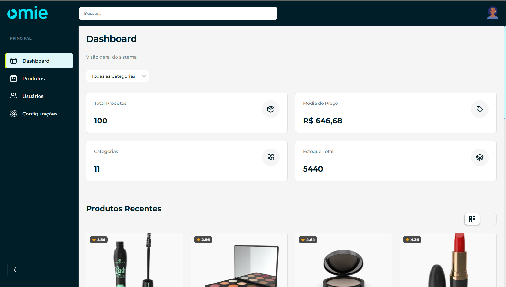

# Dashboard - Desafio Técnico

Dashboard desenvolvido para visualização de métricas de produtos e usuários. O projeto foca em arquitetura escalável, performance e fidelidade ao layout proposto, utilizando **Next.js** e **SCSS**.



## 🔗 Links
- **Deploy (Vercel):** [Omie Dashboard](https://omie-dashboard-zeta.vercel.app/)
- **Repositório:** [Github](https://github.com/mattvianna/omie_dashboard)

## 🛠 Tech Stack

* **Core:** Next.js 16 + React 19
* **Linguagem:** TypeScript 5
* **Estilização:** SCSS (Sass) + CSS Modules
* **Gerenciador de Pacotes:** NPM
* **API:** [DummyJSON](https://dummyjson.com)

## 🚀 Como Rodar o Projeto

### Pré-requisitos
* Node.js (v18 ou superior)
* NPM ou Yarn

### Passo a Passo

1. **Clone o repositório:**

   ```bash
   git clone https://github.com/SEU-USUARIO/NOME-DO-REPO.git
   cd NOME-DO-REPO
   ```

2. **Instale as dependências:**

    ```bash
    npm install
    # ou
    yarn install
    ```

3. **Execute o projeto:**

    ```bash
    npm run dev
    ```

4. **Acesse o projeto: Abra http://localhost:3000 no seu navegador.**

## 🏗 Arquitetura & Decisões Técnicas

### 1. CSS Grid & Layout Global
Optei por utilizar **CSS Grid Areas** no `layout.tsx` global.
* **Motivo:** Permite fixar o Header e a Sidebar visualmente enquanto apenas o conteúdo (`main`) possui scroll. Isso garante uma estrutura semântica (`<header>`, `<aside>`, `<main>`) e responsiva.
* **Implementação:** As dimensões do grid (largura da sidebar, altura do header) foram abstraídas para variáveis, facilitando ajustes futuros.

### 2. Design System & Tokens
Implementei um sistema de **Design Tokens** via variáveis SCSS (`_variables.scss`).
* **Paleta de Cores:** Adotei a identidade utilizada no site da Omie (https://www.omie.com.br/) adaptada para um layout de dashboard (Dark Sidebar / Light Content).
* **Escalabilidade:** Espaçamentos e cores centralizados permitem mudanças globais com uma única linha de código.

### 3. Modularização (CSS Modules)
Utilizei **CSS Modules** (`styles.module.scss`) para todos os componentes.
* **Motivo:** Garante escopo local para as classes, evitando conflitos de especificidade e "vazamento" de estilos (side-effects).
* **Padrão de Nomenclatura:** Adotei **CamelCase** para as classes para alinhar com a sintaxe de importação do JavaScript.

### 4. Design Pattern: Barrel Pattern (Ícones)
Para a organização dos assets SVG, apliquei o padrão **Barrel File**.
* **Implementação:** Um arquivo `index.ts` na pasta de ícones centraliza e re-exporta todos os componentes.
* **Benefício:** Simplifica as importações nos componentes consumidores, reduzindo múltiplas linhas de `import` para uma única chamada unificada:
  ```tsx
  import { Icons } from '@/components/icons';
  ```

### 5. Estratégia de Dados
Tomei como decisão exibir apenas 10 produtos por vez e consumir no máximo 60 itens da API. Para garantir a consistência matemática entre os KPIs e a listagem, adotei uma estratégia de carregamento unificado no Servidor `page.tsx`.

* **Problema:** Calcular KPIs baseados em paginação parcial (ex: apenas os 10 primeiros) geraria dados falsos (o preço médio ficaria incorreto).
* **Solução:** O Server Component busca o escopo total definido (60 itens) de uma única vez.
* **Benefício:** Os Cards de KPI (Total, Estoque, Preço Médio) são calculados com precisão sobre o todo, enquanto a lista recebe os dados já carregados, eliminando "loaders" adicionais e requisições duplicadas.

### 6. Performance: Renderização Progressiva
Embora o cliente receba os 60 itens, renderizar todos de uma vez afetaria a performance inicial.

* **Técnica:** Implementação de uma lista com carregamento sob demanda (Infinite Scroll) sem requisições de rede.
* **Funcionamento:** O componente mantém os dados em memória mas injeta no DOM apenas lotes de 10 itens. Conforme o usuário rola, novos lotes são liberados.

### 7. Otimização Avançada: Observer Pattern com useRef
Para o scroll infinito, utilizei a API IntersectionObserver com o padrão Ref Bridge.

* **Desafio:** A implementação do Observer exige recriar a instância toda vez que o estado da lista muda, causando perda de performance.

* **Solução:**
  * Utilizei useRef para armazenar a função de carga (loadMore).
  * O IntersectionObserver é instanciado apenas uma única vez (na montagem).

Quando o gatilho é acionado, o Observer acessa a referência mutável (.current) da função, garantindo acesso ao estado mais recente sem precisar desconectar e reconectar o observador.

### 8. Dashboard Estratégico
Remodelei o painel para uma visão mais alinhada com o wireframes:
- **KPIs de Negócio:** Total de Produtos, Média de Preço, Diversidade de Categorias e Estoque Total.
- **Componentização:** Cards de KPI reutilizáveis com suporte a injeção de ícones SVG otimizados.

### 9. Gestão de Produtos
Nova rota `/produtos`:
- **Listagem Híbrida:** Sistema de visualização flexível com alternância instantânea entre:
  - **Modo Grid (Cards):** Foco visual na imagem e destaques do produto.
  - **Modo Lista (Tabela):** Foco em densidade de dados e comparação rápida.
- **Metadados Ricos:** Exibição condicionada de SKU, Dimensões, Rating e Status de Estoque.
- **Performance:** Scroll Infinito Virtualizado e otimização de imagens (`sizes` dinâmico).

### 10. Gestão de Usuários
Mantive a lógica usada em produtos, optei por manter o grid utilizando apenas cards.
**Tipagem Estrita:** Interfaces TypeScript completas.
- **Camada de Serviço:** Separação de responsabilidade em `services/users.ts` com tratamento de erros robusto.

### 11. UX & UI Design
- **Ícones SVG Nativos:** Biblioteca interna de ícones (`src/components/icons`) com suporte a `currentColor`.
- **Layout Responsivo:** Grid CSS inteligente que se adapta de mobile a telas ultrawide sem media queries complexas.
- **Micro-interações:** Efeitos de hover, transições suaves de layout e feedbacks visuais.
- **Collapsed Sidebar:** Botão toggle em que permite colapsar a sidebar para uma melhor visualização.

### 12. Busca Inteligente: 'URL as State'
A implementação da busca segue o padrão "URL First", onde a barra de endereço é a fonte da verdade.

- **Decisão:** Ao digitar, a URL é atualizada (?q=termo) via router.replace em vez de usar apenas um estado local (useState).
- **Benefício:** Permite compartilhar links de buscas específicas e preserva o filtro ao recarregar a página.
- **Performance:** Implementação de Debounce com useRef para gerenciar o timer. Diferente de variáveis locais, o ref persiste entre renderizações, garantindo que o delay de digitação funcione corretamente e evitando chamadas excessivas ao Router.

### 13. Consistência de Dados (API vs. Visual)
Foi identificada uma discrepância na API (DummyJSON), que utiliza "Fuzzy Search" (busca aproximada), retornando itens irrelevantes na pesquisa (ex: buscar "red" retornava eletrônicos caros com "infrared" na descrição).

- **Problema:** Isso distorcia os KPIs (Média de Preço e Total), pois o cálculo matemático considerava itens que o filtro visual do frontend escondia.
- **Solução:** Implementação de um Filtro Rigoroso no Server Component.
- **Fluxo:** A página recebe os dados "sujos" da API, aplica o mesmo filtro estrito do frontend (Título/Categoria) e só então calcula os KPIs. Isso garante que os números do Dashboard batam exatamente com a lista visualizada pelo usuário.

### 14. Sincronização de Estado e Reatividade
Para garantir a fluidez entre a Busca e o Scroll Infinito, optei por uma estratégia de **controle de estado reativo** em vez de forçar a desmontagem do componente.

* **Desafio:** Ao realizar uma nova busca, o componente precisava saber que deveria abandonar a paginação atual (ex: 100 itens carregados) e voltar ao estado inicial, sem perder a performance.
* **Solução:** Implementação de um `useEffect` no componente `<ProductList />` que monitora alterações na prop `searchQuery`.
* **Resultado:**
  ```tsx
  useEffect(() => {
    setVisibleCount(ITEMS_PER_PAGE); // Reseta visualização para 8 itens
  }, [searchQuery]);
  ```
Ao detectar uma nova busca, o componente reseta o contador de itens visíveis para o padrão.

### 15. Abstração de Filtros
Para atender o requisito de filtragem sem duplicar código, criei um componente genérico <FilterSelect />.

- **Decisão:** Em vez de criar componentes acoplados como CategoryFilter ou GenderFilter, desenvolvi um componente genérico que manipula a URL.
- **Implementação:** O componente recebe apenas a paramKey (ex: "category") e as options. Quem detém o contexto do negócio (quais opções exibir) é a Página (page.tsx), não o componente visual.
- **Benefício:** O mesmo componente é reutilizado para filtrar categorias na tela de Produtos e Gêneros nas suas respectivas telas de usuários, mantendo a consistência visual e lógica.

### 16. Filtragem Híbrida
Para garantir que os filtros de dropdown funcionem em conjunto com a busca textual:

- **Fluxo:** A página lê múltiplos parâmetros da URL (?q=phone&category=smartphones).
- **Lógica:** Aplica-se uma cadeia de filtros (filter chaining) nos dados recebidos da API antes de passá-los para a renderização.
- **Resultado:** O usuário pode refinar buscas complexas (ex: buscar "Red" apenas dentro da categoria "Lipsticks") e as KPIs recalculam instantaneamente com base nesse subconjunto de dados.


## 📂 Estrutura de Pastas

```bash
omie_dashboard/
├── package.json
├── tsconfig.json
├── next.config.ts
├── README.md
├── public/                     # assets (imagens, fontes, preview)
└── src/
    ├── app/                    # rotas & layouts (Next.js App Router)
    │   ├── globals.scss
    │   ├── layout.tsx
    │   ├── page.tsx            # dashboard (Server Component)
    │   ├── produtos/           # rota /produtos
    │   │   └── page.tsx
    │   ├── usuarios/           # rota /usuarios
    │   │   └── page.tsx
    │   └── configuracao/       # rota /configuracao
    │       └── page.tsx
    ├── components/             # componentes reutilizáveis
    │   ├── Header/
    │   ├── Sidebar/
    │   ├── SearchInput/
    │   ├── FilterSelect/
    │   ├── ProductList/
    │   ├── UserList/
    │   ├── KpiCard/
    │   └── icons/
    ├── services/               # chamadas API
    │   ├── product.ts
    │   └── users.ts
    ├── styles/                 # tokens e utilitários SCSS
    │   └── _variables.scss
    └── types/                  # tipagens TypeScript
```
